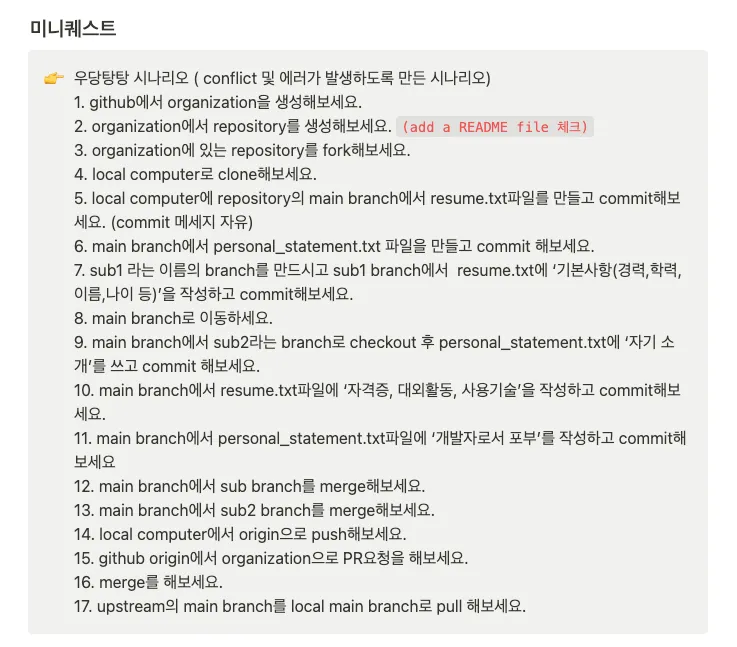

## 날짜 : 2025-01-29

### 스크럼
- Git 개념 한 줄 정리 진행 거의 끝남.
- Git PR 실습 진행 (우당탕탕 시나리오) 진행하다 잠듦.

### 새로 배운 내용
#### 주제 1: Merge의 여러 방법
##### 1. 3-way merge
    특징 : 두 브랜치 이력 모두 유지
    상황 : 이력 관리가 중요, 두 브랜치에서 작업 내용이 많을 경우
    장점 : 이력이 명확히 드러남
    단점 : 커밋 너무 많아서 이력 복잡해짐
##### 2. Rebase 
    특징 : 다른 브랜치의 커밋을 현재 브랜치로 가져와서 선형적인 히스토리 남길 수 있음
    상황 : conflict가 적은 상태, 이력 단순하게 하고 싶음
    장점 : 커밋 기록이 깔끔함, 보기 쉬움
    단점 : 이미 push한 커밋을 rebase하면 rewriting history?때문에 충돌이 발생할 수 있음
##### 3. Squash & merge
    특징 : PR을 merge할 경우 커밋 여러개를 하나로 병합
    상황 : feature 개발 브랜치에서 커밋 여러번 갈김
    장점 : 불필요한 커밋 이력 줄어듬
    단점 : 세부 이력이 없어짐

#### 주제 2: Ark 브라우저와 Pull Requests
- PR 실습 진행 후 아래와 같은 이상한 폴더를 발견함

- Ark 브라우저 사용하여 PR을 할 경우, Assginer로 본인이 지정되면 해당 폴더에 승인해달라는 PR이 담기게 된다고 한다!!
- 굉장히 유용할 것 같은 기능이다.

### 오늘의 도전 과제와 해결 방법
#### Git PR 실습 진행 (우당탕탕 시나리오)

    과정을 진행하면서 발생하는 conflict를 해결, 과정을 상세히 기록

### 오늘의 회고
- 생각지도 못한 브라우저 기능을 발견해서 좋았다. 지원은 종료된다고 했지만, 유용한 점들도 많고 대체하기 힘든 부분들도 많아서 당장은 계속 사용할 듯 하다.
- Commit이나 브랜치를 코드를 이용하여 처리하니 구조를 잘 알 수 있어서 도움이 되었다. 자주 이렇게 사용하면 익히기 쉬울 것 같다.

### 참고 자료 및 링크
- [PR 실습 정리된 노션](https://helpful-diadem-529.notion.site/Git-1894356f245c809e90d0fa491742b871?pvs=74)
